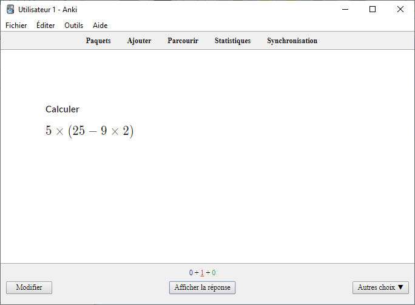

# mathalea_pour_anki
## Présentation
__**MathALEA pour Anki**__ est un [modèle de carte](https://apps.ankiweb.net/docs/manual.fr.html#les-mod%C3%A8les-de-cartes "Sur Anki, les modèles de cartes définissent comment afficher les différents éléments d'une carte") sur [Anki](https://apps.ankiweb.net/ "lien vers la page de téléchargement de l'application") qui permet de se créer rapidement et simplement des [cartes](https://apps.ankiweb.net/docs/manual.fr.html#les-cartes "Anki virtualise le concept des ''flashcards'' et a gardé le nom de ''cartes'' pour désigner le couple formé par une question et une réponse") à partir des exercices de [MathALEA](https://coopmaths.fr/mathalea.html? "lien vers le générateur d'exercices").
## Exemples
|Application|Recto|Verso|
|:---------:|:---:|:---:|
|Windows|||
|AnkiDroid|||

## Créer une nouvelle carte depuis une version Desktop
|||
|:---:|:---:|
||1 - Cliquer sur __**Ajouter**__   2 - Choisir le type de note __**MathALEA Basique RC**__   3 - Choisir le paquet dans lequel on veut mettre la nouvelle carte   4 - Coller le titre de l'exercice dans le champ __**Titre**__. Ce sera le nom de la carte dans le navigateur de Anki   5 - Coller l'url de l'exercice désiré   6 - Valider la saisie grâce au bouton __**Ajouter**__|

## Mise à jour manuelle (ou comment construire à partir des sources)
|||
|:---:|:---:|
|||
||Pour chacune des trois parties __**Modèle du recto**__ (__**1**__), __**Modèle du verso**__ (__**2**__) et __**Styles**__ (__**3**__), ,   effacer le contenu du cadre __**4**__ et coller le code du fichier correspondant (par exemple __**Basique_modele_du_recto**__)|

## Mise à jour à l'aide d'un fichier .apkg
Au lieu de copier et de coller les différentes parties du code, on peut plus simplement importer un paquet au format .apkg.
Afin d'être certain que la version utilisée soit bien la dernière, je vous conseille, avant l'importation, de supprimer toutes les éventuelles versions précédentes de __**MathALEA pour Anki**__. (__**Important :**__ ne surtout pas faire ceci en production sans un export préalable car cela supprimera toutes les cartes liées à un type de note. Pour faire une mise à jour par ce moyen en production, la procédure est : exporter les cartes en .csv, supprimer le type de note, importer le .apgk, importer le .csv et le ratacher au nouveau type de note)
|||
|:---:|:---:|
|||
|

## Ressource libre utilisée
[Anki-persistence](https://github.com/SimonLammer/anki-persistence) qui permet de conserver la série de l'exercice entre le recto et le verso.